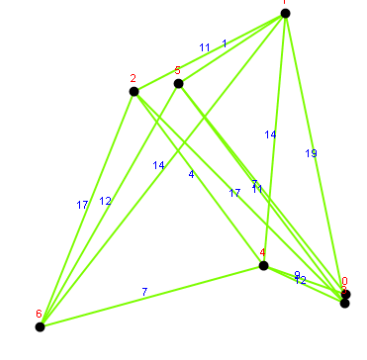
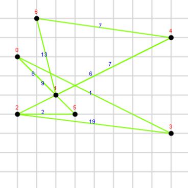
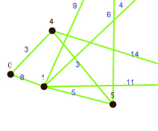
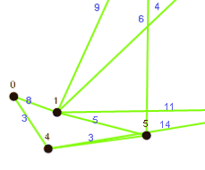
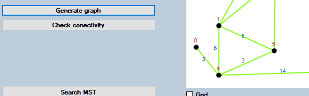
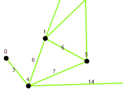
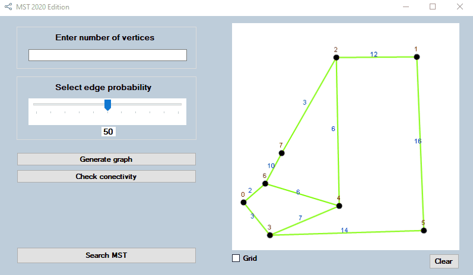
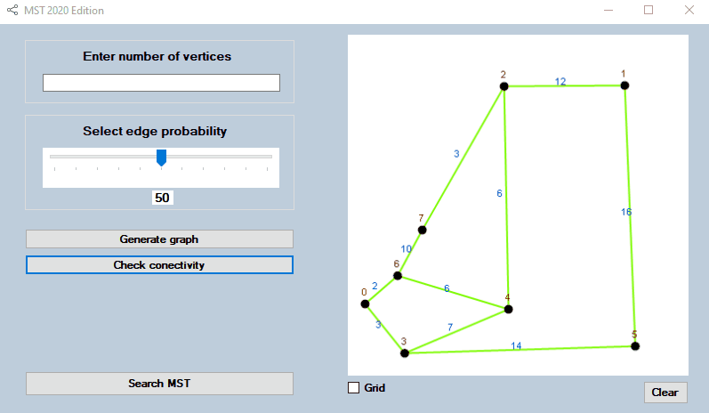

# Minimal Spanning Tree

Simple application for search mimimal spanning tre in graph wtitten in C# using WinForms.

The program uses the Kruskal algorithm to find the minimum spanning tree that can be traced step by step.

## Graph generation 

To generate graph user have to insert number of nodes in graph and set propability of egde between nodes via slider.

## Graph drawing

Program offers three ways of drawing:

|Random  |Circle |Grid   |
|--------|-------|-------|
| |  ||

## Edit

- Move node: left click

- Create/Delete edge: right click on first node and the on second to create or delete edge between them

- Change edge weight - double click on egde, then insert nwe value on textbox and confirm with "Edit" button

- Create/Delete node - middle click on free space to create node or on existing node to remove node

  

## Check conectivity 

To find minimal spanning tree the graph need to be conected. User can check conectivity by clicking on "Check conectivity" button and see the animitation of depth-first search algorithm.

## Minimal spanning tree

Kruskal algorithm can by run by clicking "Search MST" button.

